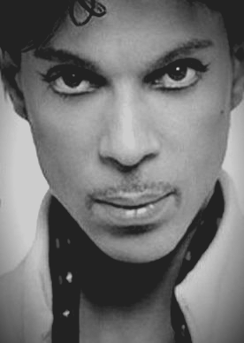

**_Style_** is the sixth track on the third disc of Prince's 19th album Emancipation, the third album to be credited to **O(+>**, and was released on November 19, 1996. Emancipation was, notably, the third album Prince released in 1996 (along with the *Girl 6* soundtrack and *Chaos and Disorder*) and the first album after he had fulfilled his contract with Warner Bros.

This song has very laid-back, almost conversational, lyrics, which are often quite humorous. Throughout, Prince muses on various traits and qualities that make up his idea of "Style." Many of these are definitely #lifegoals. Here's a few of my favorites.

> Style is keeping a promise. 

> Style is not a lie. 

> Style is a man that cries. 

> Style is no fear of death. 

> Style is you and me. 

> Style is an accurate account of what's inside every heart. 

> Style is not thinking about style, so let me stop. 

And, finally, we have a lyric that, for me, holds enough meaning to have become one of my core life philosophies.

> Style is not lusting after someone because they're cool. Style is loving yourself until everyone else does too.
