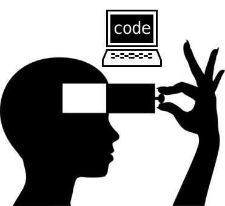

Originally posted on my now-defunct teaching/learning site, Disciples of Code, on February 17, 2014. 

## On Code

### Code is everywhere - Coding is an essential language

I say code, you say program. He says script, she says app. Does it matter? Putting aside the many technical definitions and nuances, in practice these terms are nearly synonymous — at least to a general audience. What we're really talking about is machine language, or a way of communicating with machines (e.g., computers) by combining a set of symbols, words, and statements according to certain predefined rules. 

> Communication is more than just words, communication is architecture, because of course it is quite obvious that a house which would be built without that will, that desire to communicate, would not look the way your house looks today.
> — Poe (Music Artist)

Does this sound familiar? It should. It is identical to the way in which we learn any human language. Code is simply a machine language. While some human languages are moire difficult to learn than others, some machine languages involve trickier grammar or more complex syntax. The driving purpose for learning in both cases is whether the language learner can create something that makes sense to others.

Machine languages differ from human languages in many important ways. Speaking and listening aren&rsquo;t often a crucial part of machine languages, but they are vital to human languages; speaking code is not usually performative. Human languages tend to be chronological and have a structural basis at the sentence level. Machine languages don&rsquo;t require strict chronologies, and often encourage using conditional structures to branch off from the linear path — perhaps, infinitely.

## Decoding the Why

### Developers pursue coding for many reasons

You can launch your favorite web browser and do an Internet search, and find any number of individuals and organizations offering reason after reason that learning to code is important. You can most likely find an equal number offering an opposing opinion. Of course, like with nearly all subjects of grand relevance, what this really means is that the “Why” to the importance of coding, is up to you. And with any endeavor, the end result and polished nature of the output is nowhere near as significant as the attitude and approach of the individual undertaking the task. As such, I can only offer you a few of my own personal WHYs, and let you decide what value learning to code has to you.

### Problem-solving & People-relating

Writing, debugging, refactoring, and deploying code (both your own and that of others) are fundamentally problem-solving activities. Whether trying to track down a particularly annoying bug, or trying to figure out how to do something cool, working with code requires lateral thinking. Often, this involves working with other people, and allows us to learn and grow and discover new ways of approaching problems, while we learn new ways of relating to others.

### Confidence & Creation

Literacy in any language often leads to an increased sense of confidence, not only in terms of social interactions, but also in shaping the environments around you. It gives us a more solid and diverse foundation for decoding, or understanding, everything around us. And with understanding, comes the ability to see alternative solutions and possibilities previously hidden. We can respond intelligently to the challenges we face. We can build upon that understanding, and create or innovate. Few impulses in life stir us more deeply than that of creation. Realizing that you cannot only change and influence things, but build things which other people can use is a powerful thought.

### Taking Back Control

Many people these days feel that they have few options. Buried under crushing debt. Slaving away at a job they hate to barely make ends meet. Missing out on the things in life that truly matter — spending time with your children as they grow up, visiting that one place your heart has always longed to see — because of the incessant feeling of helplessness and powerlessness. Learning to code is a choice to empower yourself, to equip yourself with one of the most desirable skill sets in the workforce. And when you have skills that are desirable, you are presented with a wide array of options that you didn’t have before. Create mobile apps while being a stay-at-home dad? Easily accomplished. Pay off all of your student loan debt in a year or two? With enough leftover for some toys and vacations, no less! But most importantly, by making the choice to learn to code, you are making a decision to refuse to persist in a negative state. You refuse to allow anyone else to control your life. Only you can change your world.

## Discipline as Disciples

### Discipline is important in learning any new skill

So you are ready to begin your journey and learn to code, but you don’t know where to begin. Of course, information is free, for those willing to find it, but not all information is as valuable or worthwhile when you are just starting out. At this point, you can&rsquo;t tell bad code from good. You have no idea whether you should start out by thumbing through some massive tome of seemingly arcane jargon in an attempt to glean some tidbit of understanding, or simply fire up your trusty Internet search engine and dive in head-first.

Here’s where I have to throw out a few caveats. If you want to reap all of the benefits outlined in above (and many, many more), you’re going to have to put forth a not insignificant amount of effort. You need to learn the correct way of communicating before you can make the machines sing. You need to gain a deep understanding of the methodology and purpose behind each symbol, word, or sentence to be able to fluently and effortlessly convey your own meaning. And all of this takes discipline. You must make the decision now to set aside some time every day to learn and practice, to sharpen and reinforce, to improve. But don’t worry, before you know it, you’ll be writing code in your spare time just for the joy of it. Trust me.

It’s said that if you want to learn the essence of something, mentor with someone who is passionate to the point of obsession about that thing. Surround yourself with others who live, breathe, eat, and sleep the thing which you yearn to understand. Ask questions fearlessly, and accept criticism courageously. Find other who are on a similar journey (and really, we are always on a similar journey). Learning from and teaching your peers will only serve to strengthen your own grasp of the subject matter. You must have discipline in learning. You must be a disciple.

Some say that writing code is an art-form. In fact, I’ve often referred to myself as a “code artist”. If this is true, some inherent or implied mystery must exist, as with all art, some deeper meaning self-defined within each of us. Some interpretive quality to our individual experience with code that we carry with us, and convey unto others. While it is true that there will always be someone out there who knows more on a given subject than you, you can rest assured that only you feel and experience code as you do. So let’s take the journey together, and learn from one another, as Disciples of Code.