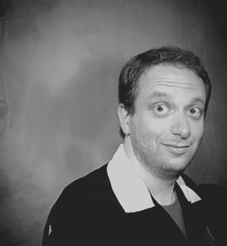

> And while it is true I am a supergenius with a robotic house and a rock-climbing tree, I am not perfect. No, really. I'm not! I'll pause to let the disillusioned stop crying. It's sad when heroes die.
>
> - Mark Gottlieb

