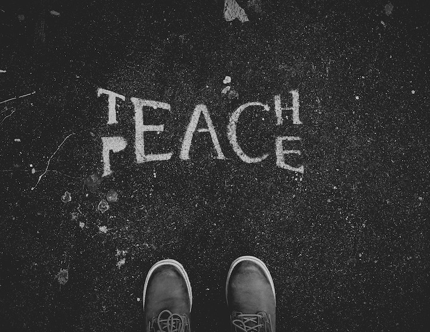

> I have a limited amount of time and energy in my life.
> I choose (an active choice, with agency) to waste neither on negativity towards myself or others.
> I refuse to be anything but the best.
> 
> - Nathanial L. McConnell

