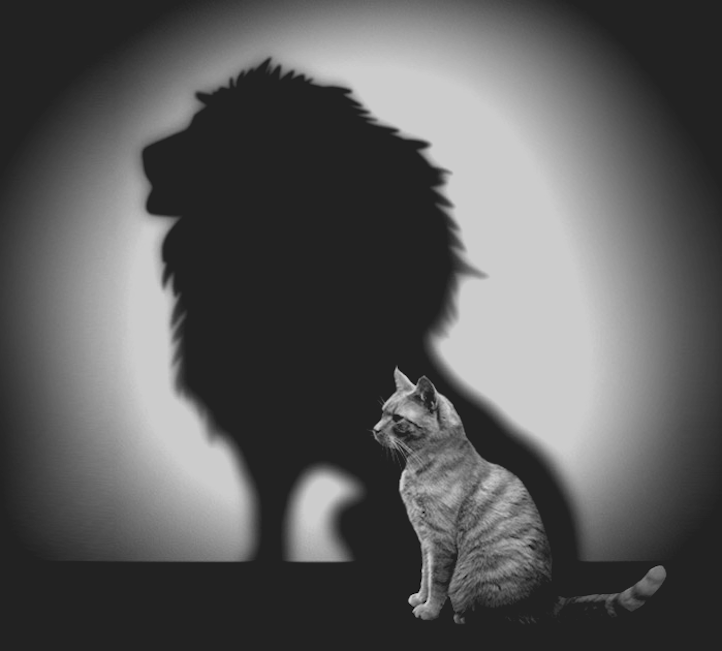

> Confidence is often mistaken for arrogance by those with low self-esteem.
> Arrogance is simply confidence lacking humility.
>
> — Nathanial L. McConnell

At some point, traits like being aggressive, loud, opinionated, and arrogant became associated with confidence. Those having this type of "confidence" often have a stagnant and immutable mindset. Their beliefs are the unequivocal truth; the truth must be told...to everyone. They are the leaders of the pack; they are "woke." If others can't be convinced of this truth and adopt the same beliefs, they are derogatorily dismissed (as "sheep", "asleep", etc.).

At the same time, traits like being weak, shy, meek, and cowering became associated with humility. Those having this type of "humility" often have a fluctuating and insecure mindset. Their beliefs aren't certain; they keep them to themselves. They are the ones that try to avoid notice; they are unsure of themselves. Easily influenced and readily changed, their beliefs hold up only if others don't offer up mldly compelling, differing alternatives. When they do speak up, they do so with vehemence, attempting to convince others of their beliefs, so that they can convince themselves.

> Because one believes in oneself, one doesn't try to convince others. Because one is content with oneself, one doesn't need others' approval. Because one accepts oneself, the whole world accepts him or her.
>
> - Lao Tzu

A person may develop artificial confidence, or arrogance, for a variety of reasons. Cognitive dissonance may be one of these reasons. This is a mental discomfort triggered by situations in which a person's beliefs clash with newly-perceived evidence. When confronted with facts that contradict personal beliefs, ideals, and values, people will often find a way to resolve the contradiction in order to reduce their discomfort. Arrogant people will often ignore new evidence and facts outright, maintaining willful ignorance. At other times, they will lash out in anger as a response to what they perceive is an attack upon something deeply ingrained in their sense of self. Fear is the culprit of their denial of or attack upon the facts. A fear of change, fueled by ego.

Those with genuine confidence don't need to get angry, because they're unafraid of being wrong and unattached to the outcome of being disbelieved by others. They are open to new evidence and willingly adjust their mindset and beliefs to assimilate new viewpoints, even if doing so requires fundamental redefinitions of their beliefs. Being open to new perspectives is the only way to learn something new. They can remain quiet, kind, and humble because they have no underlying fear of change, and are unhindered by ego.

To maintain humble confidence about our beliefs we must constantly question ourselves. We must also maintain a healthy skepticism, not only to new evidence, but to that in which we already believe. We must perpetually redefine and remake ourselves. This doesn't mean that we're unsure of our beliefs, but that we are wise enough to realize that everything around, and within, us is in constant flux. There are no absolutes, so maintaining a rigid system of beliefs inevitably leads to frustration, anger, and other destructive emotions.

At times, you may be enlightened by a thought shared by another person. At others, they'll be enlightened by yours. At still others, those thoughts may fall upon deaf ears. Once we realize that our truth may not be someone else's truth, we can relax into interpersonal relationshihps and view every interaction with others as a potential learning experience. With hunble confidence, we will always be learning and changing, growing into something other than we were before.

