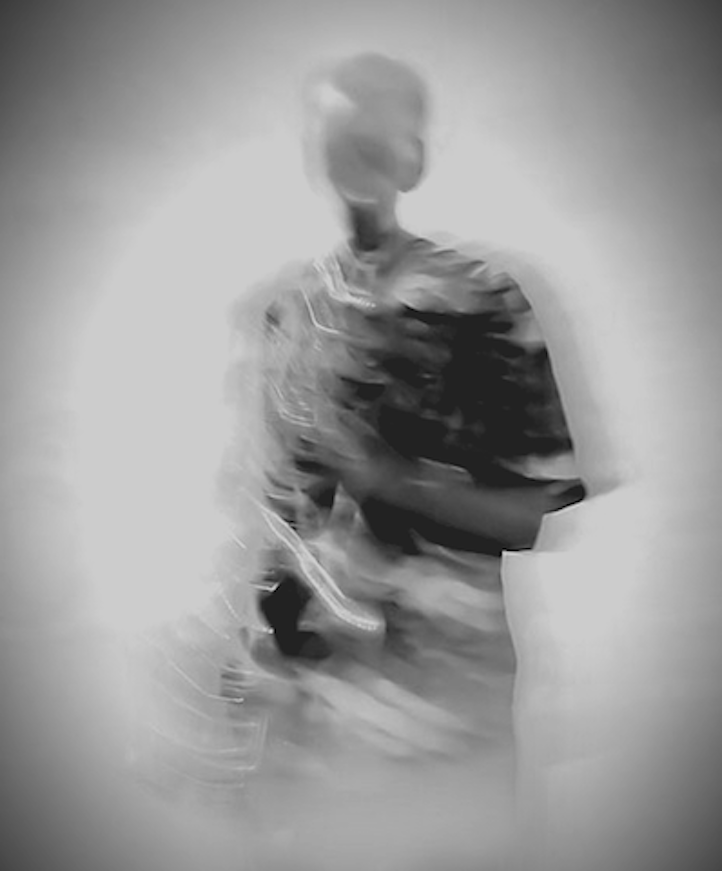

Receiving criticism is an inevitable, unpleasant experience. If you take significant actions in the world, you will draw detractors. The following pointed remark cleverly expresses this notion.

> There is only one way to avoid criticism: do nothing, say nothing, and be nothing.
>
> - Elbert Hubbard

